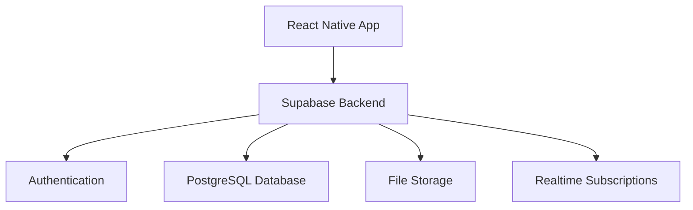

# 🚻 Loopee - Find, Review & Share Public Toilets

## The Ultimate Public Toilet Finder

Loopee transforms the experience of finding clean, accessible public toilets into a seamless, community-driven experience. Never get caught in an uncomfortable situation again - our app helps you locate the nearest toilet facilities with reliable information about cleanliness, accessibility, and amenities.


## 🌟 Key Features

### 🗺️ Smart Toilet Finding
- **Location-Based Search**: Find toilets near you with real-time distance information
- **Detailed Information**: View cleanliness ratings, accessibility status, and available amenities
- **Navigation**: Get directions directly to your chosen facility
- **Multi-Story Support**: Find toilets on specific floors within buildings

### 💬 Community-Powered Reviews
- **Rating System**: See quality ratings from other users
- **Detailed Reviews**: Read and write detailed reviews about facilities
- **Photos**: View user-submitted images of facilities
- **Trustworthiness Indicators**: Know which reviews to trust

### 🧑‍🤝‍🧑 Personalization & Social Features
- **User Profiles**: Create your account to track contributions and preferences
- **Favorites**: Save your most-used or preferred toilets
- **Sharing**: Share toilet locations with friends and family
- **Activity Feed**: Stay updated on community contributions

### 🤝 Community Contributions
- **Submit New Toilets**: Add missing toilets to help the community
- **Verification System**: Community voting ensures data quality
- **Trusted Contributor Status**: Earn recognition for valuable contributions
- **Edit & Report**: Help keep information accurate and up-to-date

## 🛠️ Technical Overview

Loopee is built with modern technologies focusing on performance, reliability, and user experience:

### Architecture



### Tech Stack

#### Frontend
- **Framework**: React Native with Expo
- **Navigation**: React Navigation
- **UI Components**: Custom components + React Native Paper
- **State Management**: React Context + Custom stores
- **Maps Integration**: React Native Maps with clustering support

#### Backend
- **Platform**: Supabase
- **Database**: PostgreSQL with PostGIS extensions for geospatial data
- **Authentication**: JWT-based auth with social login options
- **Storage**: Blob storage for user-submitted images
- **Real-time**: WebSocket subscriptions for live updates

#### Key Implementation Features
- **Optimized Location Services**: Battery-efficient location tracking with smart throttling
- **Smart Caching**: Reduced network requests with location-based invalidation and 5-minute expiration
- **Robust Authentication**: Session persistence with exponential backoff retry mechanisms
- **Duplicate Protection**: Prevents duplicate submissions at both frontend and backend levels
- **Responsive Design**: Adapts to different screen sizes and orientations with dynamic scaling

### Data Schema

Loopee uses a standardized toilet data schema with the following key components:

- **Core Information**: ID, name, location (latitude/longitude), address, rating
- **Building Details**: Building name, floor level, floor name
- **Accessibility**: Wheelchair accessibility status
- **Amenities**: Standardized format for features like baby changing stations, showers, gender-neutral options
- **Media**: User-submitted photos

The schema ensures consistency between database records and UI components with utilities for data normalization.

## 📱 App Sections

### Guest Experience
- **Map View**: Interactive map showing nearby toilets with clustering for better performance
- **Toilet Details**: Comprehensive information about each facility
- **Basic Search**: Find toilets without requiring an account

### Authenticated Experience
- **Profile Management**: User profiles with preferences and contribution history
- **Contribution System**: Multi-step process for adding new toilets
- **Review System**: Rate and review facilities you've visited
- **Social Features**: Follow trusted contributors and share discoveries

## 🚀 Getting Started

### Prerequisites
- Node.js 16+
- npm or yarn
- Expo CLI
- Supabase account (for backend)

### Installation

1. Clone the repository:
```bash
git clone https://github.com/yourusername/loopee-rn.git
cd loopee-rn
```

2. Install dependencies:
```bash
npm install
# or
yarn install
```

3. Create a `.env` file with your Supabase credentials:
```
SUPABASE_URL=your_supabase_url
SUPABASE_ANON_KEY=your_supabase_anon_key
```

4. Start the development server:
```bash
npm start
# or
yarn start
```

### Database Setup

Initialize your Supabase project with our migration scripts:

```bash
cd supabase
supabase db push
```

## 🤝 Contributing

We welcome contributions to Loopee! Here's how you can help:

### Development Workflow

1. Fork the repository
2. Create your feature branch (`git checkout -b feature/amazing-feature`)
3. Commit your changes (`git commit -m 'Add some amazing feature'`)
4. Push to the branch (`git push origin feature/amazing-feature`)
5. Open a Pull Request using our PR templates

### Contribution Guidelines

- **Code Quality**: Follow the established patterns and linting rules
- **Responsive Design**: Ensure all UI components adapt to different screen sizes
- **Accessibility**: Maintain or improve accessibility features
- **Testing**: Add tests for new functionality
- **Documentation**: Update relevant documentation for your changes

## 🗺️ Roadmap

Our vision for Loopee continues to evolve with these planned enhancements:

### Short-term Goals
- Launch social sharing features
- Implement gamification and rewards system
- Improve offline support for toilet data

### Medium-term Goals
- Add AR navigation for hard-to-find toilets
- Expand to 10 new international markets
- Implement accessibility routes and specialized filters

### Long-term Vision
- Develop IoT integration for real-time occupancy data
- Create a public API for third-party integrations
- Build partnerships with municipal services for verified data

## 📊 Success Metrics

Loopee measures success through:

### User Engagement
- **User registration rate**: Target 30% of active users
- **Login retention**: 80% of registered users return within 7 days
- **Contribution rate**: 10% of registered users submit content

### Data Quality
- **Toilet database growth**: 25% increase within first 3 months
- **Verification speed**: 90% of submissions verified within 48 hours
- **Data accuracy**: 95% positive feedback on toilet information

### Social Impact
- **Sharing rate**: 5% of toilet views result in shares
- **Follower connections**: Average of 3 follows per active user
- **Favorite collections**: 70% of registered users create favorites

## 🛡️ Recent Improvements

Loopee has undergone significant enhancements to improve performance and reliability:

- **Performance Optimization**: Reduced network requests by ~85% and battery usage by ~40%
- **Authentication Resilience**: Enhanced session handling with proactive health monitoring
- **Data Integrity**: Implemented safeguards against duplicate submissions and data corruption
- **UI Enhancement**: Fixed interface issues including review submission and rating systems
- **Database Robustness**: Standardized schema and fixed critical database functions

## 📝 License

This project is licensed under the MIT License - see the [LICENSE](LICENSE) file for details.

## 💖 Acknowledgements

- Thanks to all our amazing contributors
- Special thanks to the open-source community for the tools that made this project possible
- Icon library provided by [FontAwesome](https://fontawesome.com)
- Map integration powered by [MapBox](https://www.mapbox.com/)
