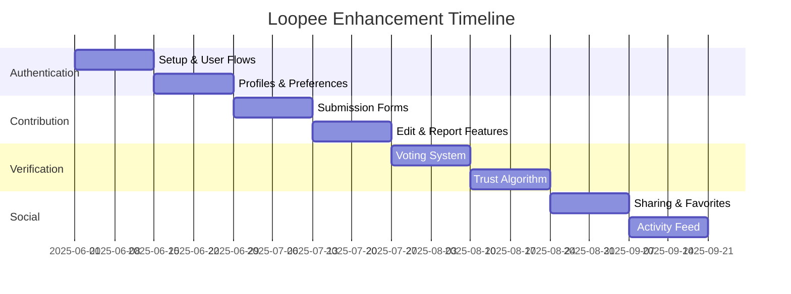

# Loopee Enhancement: Executive Summary

## Overview

This document provides a non-technical overview of the proposed Loopee app enhancements to address key feature gaps and improve the overall user experience.

## Feature Gap Analysis

The current Loopee app has been identified as having the following limitations:

1. **No user login/profile system**
   - Users cannot maintain persistent preferences
   - No personalized experience across sessions

2. **Limited social features**
   - No ability to share toilets with friends or family
   - No way to report inaccurate information

3. **No user contribution system**
   - Users cannot add new toilets to the database
   - No mechanism to correct inaccurate information

4. **No verification system**
   - No way to ensure user-submitted data is accurate
   - Risk of low-quality or inappropriate content

## Proposed Solution

Our solution addresses these gaps through four integrated feature enhancements:

### 1. Authentication System

**Business Value:**
- Enables personalized experiences
- Increases user retention through account creation
- Provides foundation for advanced features
- Builds user identity within the platform

**Key Features:**
- Email and social login options
- User profiles with preferences
- Secure authentication using industry standards
- Seamless login experience

### 2. Contribution System

**Business Value:**
- Expands toilet database rapidly at minimal cost
- Increases user engagement through contribution
- Improves data accuracy through community input
- Creates sense of ownership among users

**Key Features:**
- Multi-step toilet submission process
- Location selection with map integration
- Amenities and accessibility data collection
- Photo upload capabilities
- Edit and report functionalities

### 3. Verification System

**Business Value:**
- Ensures data quality and trustworthiness
- Reduces moderation costs through community voting
- Creates tiered trust system for power users
- Prevents spam and inappropriate content

**Key Features:**
- Community voting on submissions
- Trusted contributor status
- Auto-approval thresholds
- Admin review for contested submissions
- Transparent verification process

### 4. Social Features

**Business Value:**
- Increases app visibility through sharing
- Enhances user retention through social connections
- Provides valuable social proof
- Creates network effects for growth

**Key Features:**
- Toilet sharing via messaging and social platforms
- Favorites system for personal collections
- Following feature for trusted contributors
- Activity feed for community engagement

## Implementation Approach

The enhancements will be developed using a phased approach:

## Key Metrics for Success

We will measure the success of these enhancements using the following metrics:

### User Engagement
- **User registration rate**: Target 30% of active users
- **Login retention**: 80% of registered users return within 7 days
- **Contribution rate**: 10% of registered users submit content

### Data Quality
- **Toilet database growth**: 25% increase within first 3 months
- **Verification speed**: 90% of submissions verified within 48 hours
- **Data accuracy**: 95% positive feedback on toilet information

### Social Impact
- **Sharing rate**: 5% of toilet views result in shares
- **Follower connections**: Average of 3 follows per active user
- **Favorite collections**: 70% of registered users create favorites

## Risk Management

| Risk | Likelihood | Impact | Mitigation |
|------|------------|--------|------------|
| Low user adoption | Medium | High | Intuitive UX, soft rollout, incentives |
| Content quality issues | Medium | High | Multi-tier verification, reporting system |
| Privacy concerns | Low | Medium | Clear controls, minimal data collection |
| Performance degradation | Low | Medium | Optimized code, image compression, lazy loading |

## Competitive Advantage

These enhancements will position Loopee ahead of competitors by:

1. **Building a Community**: Creating an engaged user base with ownership
2. **Improving Data Quality**: Leveraging the crowd for accurate information
3. **Increasing Discoverability**: Enabling social sharing for organic growth
4. **Personalizing Experience**: Tailoring content to user preferences
5. **Scaling Efficiently**: Growing the database through user contributions

## Next Steps

1. **Approval**: Review and approve the enhancement proposal
2. **Development Kickoff**: Begin with Authentication System
3. **User Testing**: Validate UX with target user groups
4. **Phased Rollout**: Deploy features with A/B testing
5. **Feedback Collection**: Gather user feedback for refinement

## Conclusion

The proposed enhancements transform Loopee from a simple toilet-finding utility into a community-driven platform with rich social features. By leveraging user contributions and implementing robust verification systems, Loopee can build a comprehensive and trustworthy database while fostering user engagement and loyalty.
