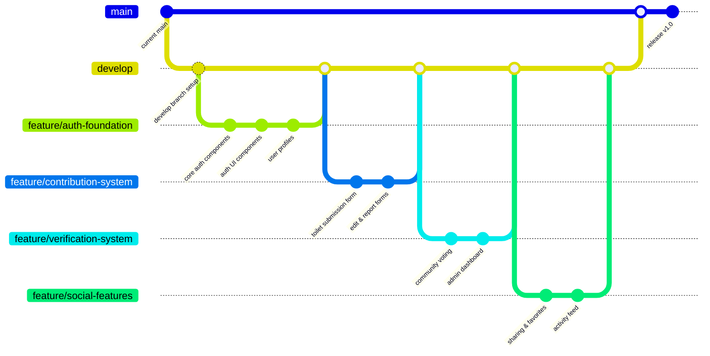

# Git Branching Strategy for Loopee Enhancement

This document outlines the Git workflow and branching strategy for implementing Loopee's new features.

## Branch Structure



## Branch Types

1. **Main Branches**:
   - `main`: Production-ready code, always stable
   - `develop`: Integration branch for features, pre-release testing

2. **Feature Branches**:
   - Naming: `feature/feature-name`
   - Branched from: `develop`
   - Merge back to: `develop`
   - Purpose: Implement individual features in isolation

3. **Sub-feature Branches** (if needed):
   - Naming: `feature/feature-name/sub-feature`
   - Branched from: Parent feature branch
   - Merge back to: Parent feature branch
   - Purpose: Complex features requiring team collaboration

4. **Bugfix Branches**:
   - Naming: `bugfix/issue-name`
   - Branched from: `develop`
   - Merge back to: `develop`
   - Purpose: Fix issues in development

5. **Hotfix Branches**:
   - Naming: `hotfix/issue-name`
   - Branched from: `main`
   - Merge back to: `main` AND `develop`
   - Purpose: Fix critical production issues

6. **Release Branches**:
   - Naming: `release/version-number`
   - Branched from: `develop`
   - Merge back to: `main` AND `develop`
   - Purpose: Prepare for production release

## Workflow for Implementing a Feature

### 1. Create Feature Branch

```bash
# Ensure develop is up to date
git checkout develop
git pull origin develop

# Create feature branch
git checkout -b feature/feature-name
```

### 2. Develop and Commit

```bash
# Make changes and commit regularly
git add .
git commit -m "Descriptive message about changes"

# Push to remote (first time)
git push -u origin feature/feature-name

# Subsequent pushes
git push
```

### 3. Keep Branch Updated

```bash
# Update with latest from develop
git checkout develop
git pull origin develop
git checkout feature/feature-name
git merge develop
# Resolve any conflicts
```

### 4. Create Pull Request

When the feature is complete:
1. Push final changes
2. Create pull request from feature branch to develop
3. Add description, screenshots, testing notes
4. Request reviews

### 5. Review and Merge

After approval:
1. Merge the PR into develop
2. Delete the feature branch when no longer needed

## Special Cases

### Hotfixes

For urgent production issues:

```bash
git checkout main
git pull origin main
git checkout -b hotfix/issue-name
# Make fixes
git commit -m "Fix critical issue X"
git push -u origin hotfix/issue-name
# Create PR to main
# After merge to main, also merge to develop
```

### Release Process

```bash
git checkout develop
git checkout -b release/1.0.0
# Final testing and fixes
git push -u origin release/1.0.0
# Create PR to main
# After merge to main, tag the release
git checkout main
git pull origin main
git tag -a v1.0.0 -m "Release 1.0.0"
git push origin v1.0.0
# Also merge back to develop
git checkout develop
git merge release/1.0.0
git push origin develop
```

## Commit Message Guidelines

Structure your commit messages as follows:

```
<type>: <short summary>

<optional body>

<optional footer>
```

Types:
- feat: A new feature
- fix: A bug fix
- docs: Documentation changes
- style: Formatting changes
- refactor: Code changes that neither fix bugs nor add features
- perf: Performance improvements
- test: Adding or modifying tests
- chore: Maintenance tasks

Example:
```
feat: implement user profile editing

- Add form component for editing profiles
- Implement validation
- Connect to Supabase API

Closes #123
```

## Pull Request Template

PRs should include:

1. **Title**: Clear, concise description of the change
2. **Description**: Detailed explanation of what changed and why
3. **Screenshots**: For UI changes
4. **Testing**: How the changes were tested
5. **Related Issues**: Links to related tickets
6. **Checklist**: Verification of code quality, tests, documentation

## Code Review Checklist

- Does the code follow project conventions?
- Are there appropriate tests?
- Is the documentation updated?
- Is the code efficient and maintainable?
- Are there security concerns?
- Does it meet acceptance criteria?
