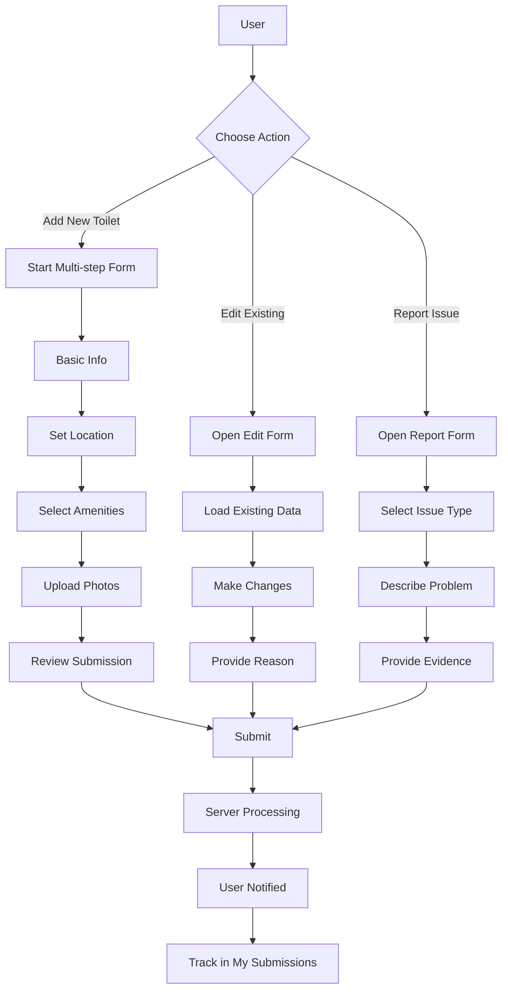

# Toilet Contribution System Implementation

This document details the implementation of the user contribution system for toilet information.

## Overview

The contribution system allows users to:
- Add new toilets to the database
- Edit existing toilet information
- Report inaccurate or inappropriate content

## Feature Branch

- **Branch Name**: `feature/contribution-system`
- **Based On**: `develop`
- **Merge Target**: `develop`
- **Dependencies**: Authentication System

## Database Schema Changes

```sql
-- Toilet submissions table
CREATE TABLE public.toilet_submissions (
  id UUID PRIMARY KEY DEFAULT uuid_generate_v4(),
  toilet_id UUID REFERENCES public.toilets, -- Null for new toilet submissions
  submitter_id UUID REFERENCES public.user_profiles NOT NULL,
  submission_type TEXT NOT NULL, -- 'new', 'edit', 'report'
  status TEXT NOT NULL DEFAULT 'pending', -- 'pending', 'approved', 'rejected'
  data JSONB NOT NULL, -- The submitted toilet data
  reason TEXT, -- Reason for edit/report
  created_at TIMESTAMPTZ DEFAULT NOW(),
  updated_at TIMESTAMPTZ DEFAULT NOW()
);

-- Create activity record on submission
CREATE FUNCTION public.record_submission_activity() 
RETURNS TRIGGER AS $$
BEGIN
  INSERT INTO public.user_activity (
    user_id, 
    activity_type, 
    entity_id,
    metadata
  )
  VALUES (
    NEW.submitter_id,
    'toilet_' || NEW.submission_type,
    COALESCE(NEW.toilet_id, NEW.id),
    jsonb_build_object('submission_id', NEW.id)
  );
  RETURN NEW;
END;
$$ LANGUAGE plpgsql;

CREATE TRIGGER on_toilet_submission
  AFTER INSERT ON public.toilet_submissions
  FOR EACH ROW EXECUTE PROCEDURE public.record_submission_activity();
```

## Component Structure

```
src/
├── components/
│   └── contribute/
│       ├── AddToiletForm.tsx       # Basic toilet info form
│       ├── AddToiletLocation.tsx   # Location picker step
│       ├── AddToiletAmenities.tsx  # Amenities selection step
│       ├── AddToiletPhotos.tsx     # Photo upload step
│       ├── AddToiletReview.tsx     # Submission review step
│       ├── EditToiletForm.tsx      # Edit existing toilet
│       └── ReportIssueForm.tsx     # Report problems
│
├── screens/
│   └── contribute/
│       ├── AddToiletScreen.tsx     # Multi-step form container
│       ├── EditToiletScreen.tsx    # Edit toilet screen
│       └── MySubmissionsScreen.tsx # User's submissions list
│
└── services/
    └── contributionService.ts      # API functions
```

## Implementation Steps

### Step 1: Build Multi-step Form Structure

1. Create form container with step navigation
2. Implement form state management
3. Add validation logic

```typescript
// src/screens/contribute/AddToiletScreen.tsx
import React, { useState } from 'react';
import { View, StyleSheet } from 'react-native';
import { useNavigation } from '@react-navigation/native';
import { AddToiletForm } from '../../components/contribute/AddToiletForm';
import { AddToiletLocation } from '../../components/contribute/AddToiletLocation';
import { AddToiletAmenities } from '../../components/contribute/AddToiletAmenities';
import { AddToiletPhotos } from '../../components/contribute/AddToiletPhotos';
import { AddToiletReview } from '../../components/contribute/AddToiletReview';
import { StepIndicator } from '../../components/contribute/StepIndicator';
import { colors, spacing } from '../../foundations';
import { Toilet } from '../../types/toilet';

// Default toilet template with null/empty values
const emptyToilet: Partial<Toilet> = {
  name: '',
  location: { latitude: 0, longitude: 0 },
  address: '',
  isAccessible: false,
  amenities: {
    hasBabyChanging: false,
    hasShower: false,
    isGenderNeutral: false,
    hasPaperTowels: false,
    hasHandDryer: false,
    hasWaterSpray: false,
    hasSoap: false,
  },
  photos: [],
};

export const AddToiletScreen: React.FC = () => {
  const navigation = useNavigation();
  const [currentStep, setCurrentStep] = useState(0);
  const [toiletData, setToiletData] = useState<Partial<Toilet>>(emptyToilet);
  
  // Update toilet data with partial changes
  const updateToiletData = (updates: Partial<Toilet>) => {
    setToiletData(prev => ({ ...prev, ...updates }));
  };
  
  // Move to next step if validation passes
  const goToNextStep = () => {
    if (currentStep < steps.length - 1) {
      setCurrentStep(currentStep + 1);
    }
  };
  
  // Move to previous step
  const goToPreviousStep = () => {
    if (currentStep > 0) {
      setCurrentStep(currentStep - 1);
    }
  };
  
  // Submit the toilet data
  const handleSubmit = async () => {
    try {
      // Implementation will be added in a later step
      console.log('Submit toilet data:', toiletData);
      navigation.goBack();
    } catch (error) {
      console.error('Error submitting toilet:', error);
    }
  };
  
  // Steps configuration
  const steps = [
    {
      title: 'Basic Info',
      component: (
        <AddToiletForm
          toiletData={toiletData}
          updateToiletData={updateToiletData}
          onNext={goToNextStep}
        />
      ),
    },
    {
      title: 'Location',
      component: (
        <AddToiletLocation
          location={toiletData.location}
          address={toiletData.address}
          updateToiletData={updateToiletData}
          onNext={goToNextStep}
          onBack={goToPreviousStep}
        />
      ),
    },
    {
      title: 'Amenities',
      component: (
        <AddToiletAmenities
          amenities={toiletData.amenities}
          isAccessible={toiletData.isAccessible}
          updateToiletData={updateToiletData}
          onNext={goToNextStep}
          onBack={goToPreviousStep}
        />
      ),
    },
    {
      title: 'Photos',
      component: (
        <AddToiletPhotos
          photos={toiletData.photos || []}
          updateToiletData={updateToiletData}
          onNext={goToNextStep}
          onBack={goToPreviousStep}
        />
      ),
    },
    {
      title: 'Review',
      component: (
        <AddToiletReview
          toiletData={toiletData}
          onSubmit={handleSubmit}
          onBack={goToPreviousStep}
        />
      ),
    },
  ];
  
  return (
    <View style={styles.container}>
      <StepIndicator
        steps={steps.map(step => step.title)}
        currentStep={currentStep}
      />
      
      <View style={styles.content}>
        {steps[currentStep].component}
      </View>
    </View>
  );
};

const styles = StyleSheet.create({
  container: {
    flex: 1,
    backgroundColor: colors.background.primary,
  },
  content: {
    flex: 1,
    padding: spacing.medium,
  },
});
```

### Step 2: Implement Location Picker

1. Add map integration for location selection
2. Enable address search
3. Implement reverse geocoding

### Step 3: Create Submission Forms

1. Build toilet information form
2. Create amenities selection interface
3. Implement photo upload functionality

### Step 4: Add Edit & Report Functionality

1. Create pre-filled edit form
2. Build issue reporting interface
3. Add reason/justification inputs

### Step 5: Implement Submission Management

1. Create user submissions dashboard
2. Add status tracking
3. Enable submission editing

## User Flow



## Contribution Service

```typescript
// src/services/contributionService.ts
import { supabase } from './supabase';
import { Toilet } from '../types/toilet';

export const contributionService = {
  // Submit a new toilet
  async submitNewToilet(toiletData: Partial<Toilet>) {
    // First, get the current user
    const { data: { user } } = await supabase.auth.getUser();
    
    if (!user) {
      throw new Error('You must be logged in to submit a toilet');
    }
    
    // Submit to the toilet_submissions table
    const { data, error } = await supabase
      .from('toilet_submissions')
      .insert([{
        submitter_id: user.id,
        submission_type: 'new',
        data: toiletData,
        status: 'pending',
      }])
      .select();
      
    if (error) throw error;
    return data[0];
  },
  
  // Submit edits to an existing toilet
  async submitToiletEdit(toiletId: string, toiletData: Partial<Toilet>, reason: string) {
    const { data: { user } } = await supabase.auth.getUser();
    
    if (!user) {
      throw new Error('You must be logged in to edit a toilet');
    }
    
    const { data, error } = await supabase
      .from('toilet_submissions')
      .insert([{
        toilet_id: toiletId,
        submitter_id: user.id,
        submission_type: 'edit',
        data: toiletData,
        reason,
        status: 'pending',
      }])
      .select();
      
    if (error) throw error;
    return data[0];
  },
  
  // Report an issue with a toilet
  async reportToiletIssue(toiletId: string, issueType: string, details: string) {
    const { data: { user } } = await supabase.auth.getUser();
    
    if (!user) {
      throw new Error('You must be logged in to report an issue');
    }
    
    const { data, error } = await supabase
      .from('toilet_submissions')
      .insert([{
        toilet_id: toiletId,
        submitter_id: user.id,
        submission_type: 'report',
        data: { issueType, details },
        status: 'pending',
      }])
      .select();
      
    if (error) throw error;
    return data[0];
  },
  
  // Get submissions by the current user
  async getMySubmissions() {
    const { data: { user } } = await supabase.auth.getUser();
    
    if (!user) {
      throw new Error('You must be logged in to view your submissions');
    }
    
    const { data, error } = await supabase
      .from('toilet_submissions')
      .select(`
        id,
        submission_type,
        status,
        data,
        created_at,
        toilet_id
      `)
      .eq('submitter_id', user.id)
      .order('created_at', { ascending: false });
      
    if (error) throw error;
    return data;
  },
};
```

## Testing Strategy

- **Unit Tests**: Test validation logic, form state management
- **Component Tests**: Test individual form components
- **Integration Tests**: Test form submission flow
- **Visual Tests**: Verify UI layout across device sizes

## Accessibility Considerations

- Step-by-step guidance
- Clear error messages
- Alternative text for visual elements
- Keyboard-accessible forms
- Screen reader announcements for state changes

## Performance Considerations

- Optimize image uploads
- Implement progressive loading
- Manage form state efficiently
- Use cached location data when possible

## Implementation Status

**Last Updated**: May 21, 2025

### Completed
- **Phase 1: Foundation Setup** (May 21, 2025)
  - Database schema with toilet_submissions table
  - Row Level Security (RLS) policies
  - Database triggers for submission processing
  - Types definitions
  - ContributionService API

- **Phase 2: Multi-Step Form Components** (May 21, 2025)
  - StepIndicator component
  - AddToiletForm component
  - AddToiletLocation component
  - AddToiletAmenities component
  - AddToiletPhotos component
  - AddToiletReview component

- **Phase 3: Screens and Navigation** (Partial)
  - AddToiletScreen container with step navigation

### In Progress
- **Phase 3: Screens and Navigation** (Expected: May 25, 2025)
  - EditToiletScreen implementation
  - MySubmissionsScreen implementation
  - App navigation route integration

### Pending
- **Phase 4: Edit and Report Functionality** (Expected: May 28, 2025)
  - Pre-filled edit form
  - Issue reporting interface
  - Reason/justification inputs

- **Phase 5: Submissions Management** (Expected: June 1, 2025)
  - User submissions dashboard
  - Status tracking implementation
  - Submission editing capability

## Monitoring and Analytics

Track:
- Submission success rates
- Form abandonment points
- Most reported issues
- Edit frequency by field

## Rollback Plan

1. Disable contribution forms
2. Roll back database changes with data preservation
3. Notify users of temporary feature unavailability
