# Social Features Implementation

This document details the implementation of social features to enhance user engagement in the Loopee app.

## Overview

The social features enable:
- Sharing toilets with others
- Saving favorite toilets for quick access
- Following contributors to see their submissions
- Activity feeds of toilet updates and contributions

## Feature Branch

- **Branch Name**: `feature/social-features`
- **Based On**: `develop`
- **Merge Target**: `develop`
- **Dependencies**: Authentication System

## Database Schema Changes

```sql
-- User favorites table
CREATE TABLE public.user_favorites (
  user_id UUID REFERENCES public.user_profiles NOT NULL,
  toilet_id UUID REFERENCES public.toilets NOT NULL,
  created_at TIMESTAMPTZ DEFAULT NOW(),
  PRIMARY KEY (user_id, toilet_id)
);

-- User follows table
CREATE TABLE public.user_follows (
  follower_id UUID REFERENCES public.user_profiles NOT NULL,
  followed_id UUID REFERENCES public.user_profiles NOT NULL,
  created_at TIMESTAMPTZ DEFAULT NOW(),
  PRIMARY KEY (follower_id, followed_id),
  CHECK (follower_id != followed_id) -- Prevent self-following
);

-- Activity table (already created in previous steps)
CREATE INDEX IF NOT EXISTS idx_user_activity_created_at
ON public.user_activity (created_at DESC);

CREATE INDEX IF NOT EXISTS idx_user_activity_user_id
ON public.user_activity (user_id);

-- Add notification preferences to user_profiles
ALTER TABLE public.user_profiles
ADD COLUMN notification_preferences JSONB DEFAULT '{
  "contribution_comments": true,
  "new_followers": true,
  "vote_activity": true,
  "nearby_toilets": true
}'::jsonb;
```

## Component Structure

```
src/
├── components/
│   └── social/
│       ├── ShareButton.tsx        # Toilet sharing component
│       ├── FavoriteButton.tsx     # Favorite toggling component
│       ├── FollowButton.tsx       # Follow/unfollow user button
│       ├── ActivityItem.tsx       # Activity feed item
│       ├── UserListItem.tsx       # User list item for followers
│       └── ToiletShareCard.tsx    # Preview card for sharing
│
├── screens/
│   └── social/
│       ├── FavoritesScreen.tsx    # User's saved toilets
│       ├── FollowingScreen.tsx    # Users the current user follows
│       ├── FollowersScreen.tsx    # Users following the current user
│       ├── ActivityFeedScreen.tsx # Activity feed
│       └── UserProfileScreen.tsx  # Public user profile
│
└── services/
    └── socialService.ts           # Social features API functions
```

## Implementation Steps

### Step 1: Implement Toilet Sharing

1. Create share functionality using Share API
2. Generate shareable links
3. Implement deep linking support

```typescript
// src/components/social/ShareButton.tsx
import React from 'react';
import { TouchableOpacity, Share, StyleSheet, Alert } from 'react-native';
import { Ionicons } from '@expo/vector-icons';
import { colors, spacing } from '../../foundations';
import { Toilet } from '../../types/toilet';

interface ShareButtonProps {
  toilet: Toilet;
  size?: number;
  color?: string;
  style?: object;
}

export const ShareButton: React.FC<ShareButtonProps> = ({
  toilet,
  size = 24,
  color = colors.text.primary,
  style,
}) => {
  const handleShare = async () => {
    try {
      // Create the share link
      const shareUrl = `https://loopee.app/toilet/${toilet.id}`;
      
      // Generate a message
      const message = `Check out this toilet: ${toilet.name} at ${toilet.address}`;
      
      // Show the share sheet
      const result = await Share.share({
        message,
        url: shareUrl,
        title: toilet.name,
      });
      
      if (result.action === Share.sharedAction) {
        // Track sharing analytics (to be implemented)
        console.log('Shared successfully');
      }
    } catch (error) {
      Alert.alert('Error', 'Could not share this toilet');
      console.error('Share error:', error);
    }
  };
  
  return (
    <TouchableOpacity
      style={[styles.container, style]}
      onPress={handleShare}
      accessibilityLabel={`Share ${toilet.name}`}
      accessibilityRole="button"
    >
      <Ionicons name="share-outline" size={size} color={color} />
    </TouchableOpacity>
  );
};

const styles = StyleSheet.create({
  container: {
    padding: spacing.xsmall,
  },
});
```

### Step 2: Create Favorites System

1. Implement favorites toggle button
2. Build favorites management service
3. Create favorites screen

```typescript
// src/services/socialService.ts
import { supabase } from './supabase';
import { Toilet } from '../types/toilet';

export const socialService = {
  // Favorites
  async getFavorites() {
    const { data: { user } } = await supabase.auth.getUser();
    
    if (!user) {
      throw new Error('You must be logged in to get favorites');
    }
    
    const { data, error } = await supabase
      .from('user_favorites')
      .select(`
        toilet_id,
        created_at,
        toilets (
          id,
          name,
          location,
          rating,
          is_accessible,
          address,
          amenities,
          building_name,
          floor_level
        )
      `)
      .eq('user_id', user.id)
      .order('created_at', { ascending: false });
      
    if (error) throw error;
    
    // Transform the data to return just the toilets with the favorite timestamp
    return data.map(item => ({
      ...item.toilets,
      favorited_at: item.created_at
    }));
  },
  
  async addFavorite(toiletId: string) {
    const { data: { user } } = await supabase.auth.getUser();
    
    if (!user) {
      throw new Error('You must be logged in to add a favorite');
    }
    
    const { error } = await supabase
      .from('user_favorites')
      .insert({
        user_id: user.id,
        toilet_id: toiletId
      });
      
    if (error) throw error;
  },
  
  async removeFavorite(toiletId: string) {
    const { data: { user } } = await supabase.auth.getUser();
    
    if (!user) {
      throw new Error('You must be logged in to remove a favorite');
    }
    
    const { error } = await supabase
      .from('user_favorites')
      .delete()
      .eq('user_id', user.id)
      .eq('toilet_id', toiletId);
      
    if (error) throw error;
  },
  
  async isFavorite(toiletId: string) {
    const { data: { user } } = await supabase.auth.getUser();
    
    if (!user) return false;
    
    const { data, error } = await supabase
      .from('user_favorites')
      .select('toilet_id')
      .eq('user_id', user.id)
      .eq('toilet_id', toiletId)
      .maybeSingle();
      
    if (error) throw error;
    return !!data;
  },
  
  // Follows
  async followUser(userId: string) {
    const { data: { user } } = await supabase.auth.getUser();
    
    if (!user) {
      throw new Error('You must be logged in to follow a user');
    }
    
    if (user.id === userId) {
      throw new Error('You cannot follow yourself');
    }
    
    const { error } = await supabase
      .from('user_follows')
      .insert({
        follower_id: user.id,
        followed_id: userId
      });
      
    if (error) throw error;
  },
  
  async unfollowUser(userId: string) {
    const { data: { user } } = await supabase.auth.getUser();
    
    if (!user) {
      throw new Error('You must be logged in to unfollow a user');
    }
    
    const { error } = await supabase
      .from('user_follows')
      .delete()
      .eq('follower_id', user.id)
      .eq('followed_id', userId);
      
    if (error) throw error;
  },
  
  async isFollowing(userId: string) {
    const { data: { user } } = await supabase.auth.getUser();
    
    if (!user) return false;
    
    const { data, error } = await supabase
      .from('user_follows')
      .select('followed_id')
      .eq('follower_id', user.id)
      .eq('followed_id', userId)
      .maybeSingle();
      
    if (error) throw error;
    return !!data;
  },
  
  async getFollowers(userId: string) {
    const { data, error } = await supabase
      .from('user_follows')
      .select(`
        follower_id,
        user_profiles!user_follows_follower_id_fkey (
          id,
          username,
          display_name,
          avatar_url,
          contribution_count,
          trusted_status
        )
      `)
      .eq('followed_id', userId)
      .order('created_at', { ascending: false });
      
    if (error) throw error;
    
    return data.map(item => item.user_profiles);
  },
  
  async getFollowing(userId: string) {
    const { data, error } = await supabase
      .from('user_follows')
      .select(`
        followed_id,
        user_profiles!user_follows_followed_id_fkey (
          id,
          username,
          display_name,
          avatar_url,
          contribution_count,
          trusted_status
        )
      `)
      .eq('follower_id', userId)
      .order('created_at', { ascending: false });
      
    if (error) throw error;
    
    return data.map(item => item.user_profiles);
  },
  
  // Activity feed
  async getActivityFeed() {
    const { data: { user } } = await supabase.auth.getUser();
    
    if (!user) {
      throw new Error('You must be logged in to view the activity feed');
    }
    
    // Get users the current user follows
    const { data: following, error: followingError } = await supabase
      .from('user_follows')
      .select('followed_id')
      .eq('follower_id', user.id);
      
    if (followingError) throw followingError;
    
    // Get activity from those users
    const followedIds = following.map(f => f.followed_id);
    
    // Include the current user's ID to see their own activity
    followedIds.push(user.id);
    
    const { data, error } = await supabase
      .from('user_activity')
      .select(`
        id,
        user_id,
        activity_type,
        entity_id,
        metadata,
        created_at,
        user_profiles (
          id,
          username,
          display_name,
          avatar_url,
          trusted_status
        )
      `)
      .in('user_id', followedIds)
      .order('created_at', { ascending: false })
      .limit(50);
      
    if (error) throw error;
    
    return data;
  }
};
```

### Step 3: Implement Follow System

1. Create follow/unfollow button
2. Build followers and following screens
3. Implement user profiles

### Step 4: Build Activity Feed

1. Create activity feed screen
2. Implement activity item components
3. Add pull-to-refresh functionality

### Step 5: Add Deep Linking

1. Configure URL schemes
2. Implement deeplink handlers
3. Add navigation integration

## User Flow

```mermaid
graph TD
    A[User] --> B{Action}
    
    B -->|View Profile| C[User Profile Screen]
    C -->|Follow User| D[Add to Following]
    
    B -->|View Toilet| E[Toilet Detail]
    E -->|Share| F[Share Sheet]
    E -->|Favorite| G[Add to Favorites]
    
    B -->|Open App| H[Check for Deep Link]
    H -->|Toilet Link| E
    H -->|User Link| C
    
    B -->|View Feed| I[Activity Feed]
    I -->|Pull to Refresh| I
    I -->|Tap Item| J{Item Type}
    J -->|Toilet| E
    J -->|User| C
    
    B -->|View Favorites| K[Favorites Screen]
    K -->|Select Toilet| E
    K -->|Remove Favorite| L[Update List]
```



## Testing Strategy

- **Unit Tests**: Test social service functions
- **Component Tests**: Test sharing, favorite buttons
- **Integration Tests**: Test deep linking, activity feed
- **Performance Tests**: Test activity feed with large dataset

## Accessibility Considerations

- Screen reader support for all social actions
- Alternative text for shared images
- Keyboard navigation for all screens
- Clear state indicators for favorite/follow status

## Performance Considerations

- Paginate activity feed for large datasets
- Optimize favorites list rendering
- Cache follow/following status
- Use optimistic UI updates for better user experience

## Monitoring and Analytics

Track:
- Sharing frequency
- Most favorited toilets
- Follow/unfollow patterns
- Activity feed engagement

## Security Considerations

- Validate user permissions before all social actions
- Sanitize user-generated content for sharing
- Implement rate limiting for follow/unfollow actions
- Privacy controls for user profiles

## Rollback Plan

1. Disable social features temporarily
2. Preserve user data during rollback
3. Implement feature flags for gradual rollout
