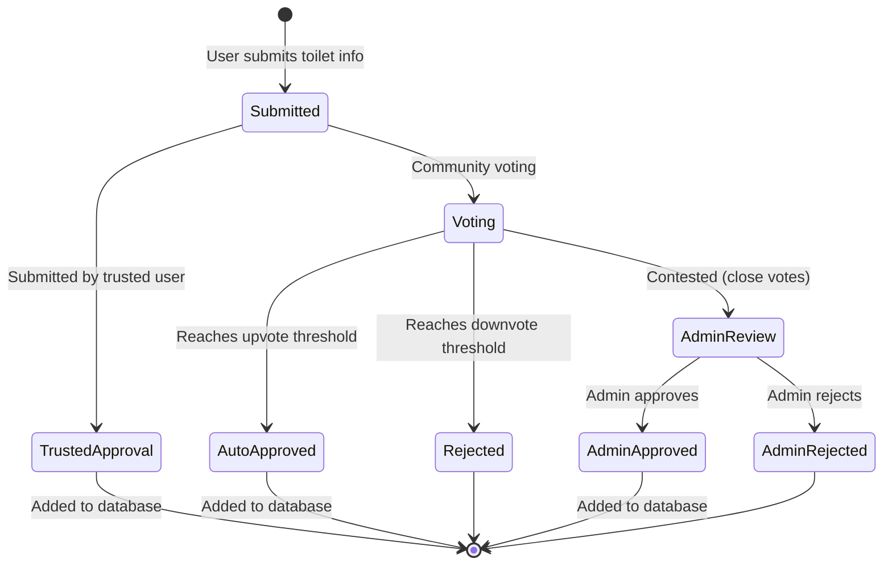

# Verification System Implementation

This document details the implementation of the community-driven verification system for toilet submissions.

## Overview

The verification system allows:
- Community voting on toilet submissions
- Automatic approval based on threshold
- Trusted contributor status
- Admin review for disputed submissions

## Feature Branch

- **Branch Name**: `feature/verification-system`
- **Based On**: `develop`
- **Merge Target**: `develop`
- **Dependencies**: Authentication System, Contribution System

## Database Schema Changes

```sql
-- Voting table
CREATE TABLE public.submission_votes (
  submission_id UUID REFERENCES public.toilet_submissions NOT NULL,
  user_id UUID REFERENCES public.user_profiles NOT NULL,
  vote_type BOOLEAN NOT NULL, -- TRUE for upvote, FALSE for downvote
  created_at TIMESTAMPTZ DEFAULT NOW(),
  PRIMARY KEY (submission_id, user_id)
);

-- Trusted status for users
ALTER TABLE public.user_profiles
ADD COLUMN contribution_count INTEGER DEFAULT 0,
ADD COLUMN trusted_status BOOLEAN DEFAULT FALSE;

-- Verification settings
CREATE TABLE public.verification_settings (
  id INTEGER PRIMARY KEY DEFAULT 1,
  votes_required INTEGER DEFAULT 3,
  trusted_auto_approve BOOLEAN DEFAULT true,
  admin_emails JSONB DEFAULT '[]'::jsonb,
  CHECK (id = 1) -- Ensure single row table
);

-- Insert default settings
INSERT INTO public.verification_settings DEFAULT VALUES;

-- Auto-approval function
CREATE OR REPLACE FUNCTION handle_submission_vote()
RETURNS TRIGGER AS $$
DECLARE
  votes_required INTEGER;
  current_up_votes INTEGER;
  current_down_votes INTEGER;
  submission_user_id UUID;
  is_trusted BOOLEAN;
BEGIN
  -- Get verification settings
  SELECT v.votes_required INTO votes_required
  FROM public.verification_settings v;
  
  -- Get current votes
  SELECT 
    COALESCE(SUM(CASE WHEN vote_type = TRUE THEN 1 ELSE 0 END), 0),
    COALESCE(SUM(CASE WHEN vote_type = FALSE THEN 1 ELSE 0 END), 0)
  INTO current_up_votes, current_down_votes
  FROM public.submission_votes
  WHERE submission_id = NEW.submission_id;
  
  -- Update vote counts in the submission
  UPDATE public.toilet_submissions
  SET 
    votes_up = current_up_votes,
    votes_down = current_down_votes
  WHERE id = NEW.submission_id;
  
  -- Check if auto-approval threshold is reached
  IF current_up_votes >= votes_required AND current_up_votes > current_down_votes * 2 THEN
    UPDATE public.toilet_submissions
    SET status = 'approved'
    WHERE id = NEW.submission_id;
    
    -- Process the approved submission
    PERFORM process_approved_submission(NEW.submission_id);
  END IF;
  
  RETURN NEW;
END;
$$ LANGUAGE plpgsql;

CREATE TRIGGER after_submission_vote
  AFTER INSERT OR UPDATE ON public.submission_votes
  FOR EACH ROW
  EXECUTE FUNCTION handle_submission_vote();

-- Process approved submissions
CREATE OR REPLACE FUNCTION process_approved_submission(submission_id UUID)
RETURNS VOID AS $$
DECLARE
  submission_record RECORD;
BEGIN
  -- Get the submission
  SELECT * INTO submission_record
  FROM public.toilet_submissions
  WHERE id = submission_id;
  
  -- Process based on submission type
  IF submission_record.submission_type = 'new' THEN
    -- Create new toilet
    INSERT INTO public.toilets (
      name,
      location,
      rating,
      is_accessible,
      address,
      amenities,
      photos
    )
    SELECT
      data->>'name',
      jsonb_build_object(
        'latitude', (data->>'latitude')::numeric,
        'longitude', (data->>'longitude')::numeric
      ),
      COALESCE((data->>'rating')::numeric, 0),
      COALESCE((data->>'isAccessible')::boolean, false),
      data->>'address',
      data->'amenities',
      data->'photos'
    FROM public.toilet_submissions
    WHERE id = submission_id;
    
  ELSIF submission_record.submission_type = 'edit' THEN
    -- Update existing toilet
    UPDATE public.toilets
    SET
      name = COALESCE(submission_record.data->>'name', name),
      address = COALESCE(submission_record.data->>'address', address),
      is_accessible = COALESCE((submission_record.data->>'isAccessible')::boolean, is_accessible),
      amenities = COALESCE(submission_record.data->'amenities', amenities),
      photos = COALESCE(submission_record.data->'photos', photos),
      updated_at = NOW()
    WHERE id = submission_record.toilet_id;
  END IF;
  
  -- Increment contribution count for submitter
  UPDATE public.user_profiles
  SET contribution_count = contribution_count + 1
  WHERE id = submission_record.submitter_id;
  
  -- Check if user should be promoted to trusted status
  UPDATE public.user_profiles
  SET trusted_status = TRUE
  WHERE id = submission_record.submitter_id
  AND contribution_count >= 5
  AND NOT trusted_status;
END;
$$ LANGUAGE plpgsql;
```

## Component Structure

```
src/
├── components/
│   └── verification/
│       ├── SubmissionVote.tsx     # Voting UI component
│       ├── SubmissionStatus.tsx   # Status display component
│       ├── SubmissionDetail.tsx   # Detailed view of submission
│       ├── AdminReviewForm.tsx    # Admin review interface
│       └── TrustedBadge.tsx       # Badge for trusted users
│
├── screens/
│   └── verification/
│       ├── PendingSubmissionsScreen.tsx  # List of pending submissions
│       ├── SubmissionDetailScreen.tsx    # Detail view of a submission
│       └── AdminDashboardScreen.tsx      # Admin review dashboard
│
└── services/
    └── verificationService.ts     # Verification API functions
```

## Implementation Steps

### Step 1: Build Voting System

1. Create voting UI components
2. Implement voting service
3. Add vote count displays

```typescript
// src/components/verification/SubmissionVote.tsx
import React, { useState } from 'react';
import { View, Text, StyleSheet, TouchableOpacity } from 'react-native';
import { Ionicons } from '@expo/vector-icons';
import { colors, spacing, typography } from '../../foundations';
import { useAuth } from '../../providers/AuthProvider';
import { verificationService } from '../../services/verificationService';

interface SubmissionVoteProps {
  submissionId: string;
  upVotes: number;
  downVotes: number;
  userVote?: boolean | null; // true = upvote, false = downvote, null = no vote
  onVoteChange?: (newUpVotes: number, newDownVotes: number) => void;
}

export const SubmissionVote: React.FC<SubmissionVoteProps> = ({
  submissionId,
  upVotes: initialUpVotes,
  downVotes: initialDownVotes,
  userVote: initialUserVote,
  onVoteChange,
}) => {
  const [upVotes, setUpVotes] = useState(initialUpVotes);
  const [downVotes, setDownVotes] = useState(initialDownVotes);
  const [userVote, setUserVote] = useState(initialUserVote);
  const [loading, setLoading] = useState(false);
  
  const { user } = useAuth();
  
  const handleVote = async (isUpvote: boolean) => {
    if (!user) return; // Require authentication
    if (loading) return;
    
    try {
      setLoading(true);
      
      // If same vote type, remove vote
      if ((isUpvote && userVote === true) || (!isUpvote && userVote === false)) {
        await verificationService.removeVote(submissionId);
        
        if (isUpvote) {
          setUpVotes(prev => prev - 1);
        } else {
          setDownVotes(prev => prev - 1);
        }
        
        setUserVote(null);
      } 
      // If different vote type, change vote
      else if (userVote !== null) {
        await verificationService.changeVote(submissionId, isUpvote);
        
        if (isUpvote) {
          setUpVotes(prev => prev + 1);
          setDownVotes(prev => prev - 1);
        } else {
          setUpVotes(prev => prev - 1);
          setDownVotes(prev => prev + 1);
        }
        
        setUserVote(isUpvote);
      } 
      // New vote
      else {
        await verificationService.addVote(submissionId, isUpvote);
        
        if (isUpvote) {
          setUpVotes(prev => prev + 1);
        } else {
          setDownVotes(prev => prev + 1);
        }
        
        setUserVote(isUpvote);
      }
      
      // Call the change handler
      if (onVoteChange) {
        onVoteChange(upVotes, downVotes);
      }
    } catch (error) {
      console.error('Error voting:', error);
    } finally {
      setLoading(false);
    }
  };
  
  return (
    <View style={styles.container}>
      <TouchableOpacity
        style={[
          styles.voteButton,
          userVote === true && styles.activeUpvote,
        ]}
        onPress={() => handleVote(true)}
        disabled={loading || !user}
        accessibilityLabel="Upvote this submission"
        accessibilityState={{ 
          disabled: loading || !user,
          selected: userVote === true,
        }}
      >
        <Ionicons
          name={userVote === true ? "thumbs-up" : "thumbs-up-outline"}
          size={20}
          color={userVote === true ? colors.white : colors.text.primary}
        />
        <Text style={[
          styles.voteCount,
          userVote === true && styles.activeVoteCount
        ]}>
          {upVotes}
        </Text>
      </TouchableOpacity>
      
      <TouchableOpacity
        style={[
          styles.voteButton,
          userVote === false && styles.activeDownvote,
        ]}
        onPress={() => handleVote(false)}
        disabled={loading || !user}
        accessibilityLabel="Downvote this submission"
        accessibilityState={{ 
          disabled: loading || !user,
          selected: userVote === false,
        }}
      >
        <Ionicons
          name={userVote === false ? "thumbs-down" : "thumbs-down-outline"}
          size={20}
          color={userVote === false ? colors.white : colors.text.primary}
        />
        <Text style={[
          styles.voteCount,
          userVote === false && styles.activeVoteCount
        ]}>
          {downVotes}
        </Text>
      </TouchableOpacity>
    </View>
  );
};

const styles = StyleSheet.create({
  container: {
    flexDirection: 'row',
    alignItems: 'center',
  },
  voteButton: {
    flexDirection: 'row',
    alignItems: 'center',
    padding: spacing.xsmall,
    borderRadius: 16,
    marginRight: spacing.small,
  },
  activeUpvote: {
    backgroundColor: colors.status.success,
  },
  activeDownvote: {
    backgroundColor: colors.status.error,
  },
  voteCount: {
    ...typography.labelMedium,
    color: colors.text.primary,
    marginLeft: spacing.xxsmall,
  },
  activeVoteCount: {
    color: colors.white,
  },
});
```

### Step 2: Implement Verification Service

```typescript
// src/services/verificationService.ts
import { supabase } from './supabase';

export const verificationService = {
  // Get pending submissions
  async getPendingSubmissions() {
    const { data, error } = await supabase
      .from('toilet_submissions')
      .select(`
        id,
        submission_type,
        status,
        data,
        toilet_id,
        submitter_id,
        votes_up,
        votes_down,
        created_at,
        user_profiles(
          username,
          display_name,
          trusted_status
        )
      `)
      .eq('status', 'pending')
      .order('created_at', { ascending: false });
      
    if (error) throw error;
    return data;
  },
  
  // Get a user's vote on a submission
  async getUserVote(submissionId: string) {
    const { data: { user } } = await supabase.auth.getUser();
    
    if (!user) return null;
    
    const { data, error } = await supabase
      .from('submission_votes')
      .select('vote_type')
      .eq('submission_id', submissionId)
      .eq('user_id', user.id)
      .maybeSingle();
      
    if (error) throw error;
    return data ? data.vote_type : null;
  },
  
  // Add a vote
  async addVote(submissionId: string, isUpvote: boolean) {
    const { data: { user } } = await supabase.auth.getUser();
    
    if (!user) {
      throw new Error('You must be logged in to vote');
    }
    
    const { error } = await supabase
      .from('submission_votes')
      .insert({
        submission_id: submissionId,
        user_id: user.id,
        vote_type: isUpvote,
      });
      
    if (error) throw error;
  },
  
  // Change a vote
  async changeVote(submissionId: string, isUpvote: boolean) {
    const { data: { user } } = await supabase.auth.getUser();
    
    if (!user) {
      throw new Error('You must be logged in to vote');
    }
    
    const { error } = await supabase
      .from('submission_votes')
      .update({ vote_type: isUpvote })
      .eq('submission_id', submissionId)
      .eq('user_id', user.id);
      
    if (error) throw error;
  },
  
  // Remove a vote
  async removeVote(submissionId: string) {
    const { data: { user } } = await supabase.auth.getUser();
    
    if (!user) {
      throw new Error('You must be logged in to vote');
    }
    
    const { error } = await supabase
      .from('submission_votes')
      .delete()
      .eq('submission_id', submissionId)
      .eq('user_id', user.id);
      
    if (error) throw error;
  },
  
  // Admin approve a submission
  async adminApproveSubmission(submissionId: string) {
    const { error } = await supabase
      .from('toilet_submissions')
      .update({ status: 'approved' })
      .eq('id', submissionId);
      
    if (error) throw error;
    
    // Process the approved submission via a stored function
    const { error: fnError } = await supabase
      .rpc('process_approved_submission', { submission_id: submissionId });
      
    if (fnError) throw fnError;
  },
  
  // Admin reject a submission
  async adminRejectSubmission(submissionId: string, reason: string) {
    const { error } = await supabase
      .from('toilet_submissions')
      .update({ 
        status: 'rejected',
        admin_notes: reason
      })
      .eq('id', submissionId);
      
    if (error) throw error;
  },
};
```

### Step 3: Build Admin Dashboard

1. Create admin review interface
2. Implement approval/rejection flow
3. Add filtering and sorting options

### Step 4: Implement Trust System

1. Create trust algorithm
2. Add trusted user badges
3. Implement auto-approval for trusted users

### Step 5: Add Community Review Screen

1. Build submission detail view
2. Add voting interface
3. Implement review status displays

## User Flow



## Testing Strategy

- **Unit Tests**: Test voting logic, trust calculations
- **Component Tests**: Test voting UI components
- **Integration Tests**: Test full verification workflow
- **Security Tests**: Verify admin access controls

## Accessibility Considerations

- Clear status indicators
- Color-blind friendly voting buttons
- Screen reader support for voting
- Keyboard accessible admin interface

## Performance Considerations

- Optimize database queries for vote counting
- Use pagination for submission lists
- Cache user vote status
- Implement batch processing for admin actions

## Monitoring and Analytics

Track:
- Time to verification
- Approval/rejection rates
- Trusted user contributions
- Admin workload

## Rollback Plan

1. Disable voting temporarily
2. Roll back database changes with data preservation
3. Temporarily switch to admin-only approval
