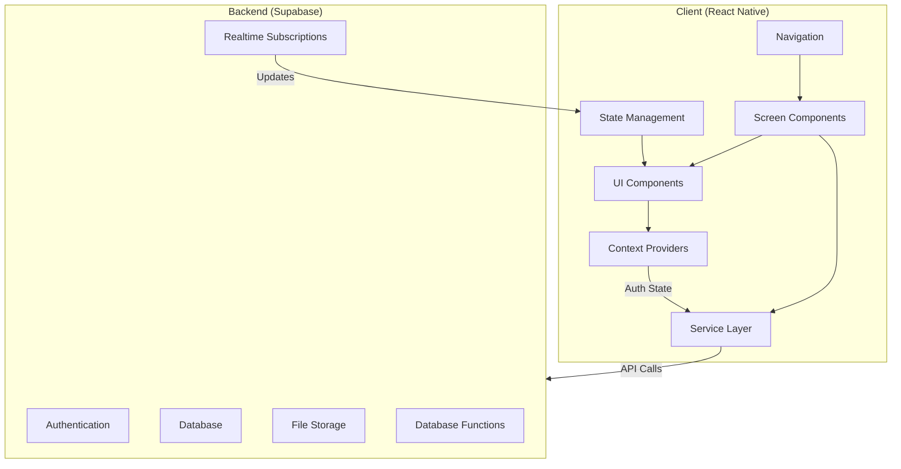
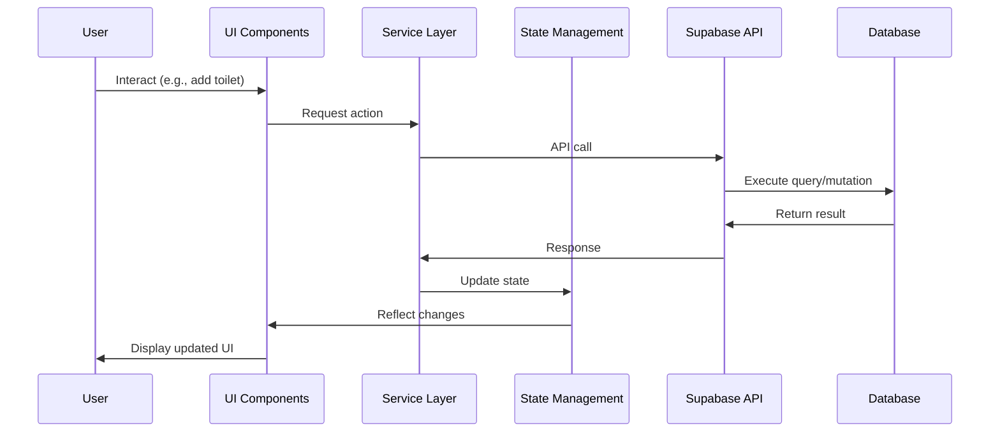
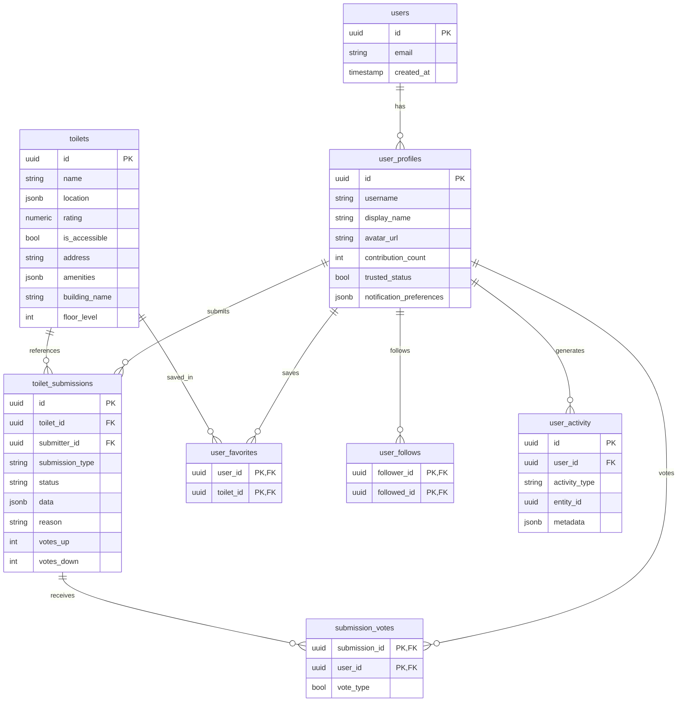

# Loopee Technical Architecture Overview

This document provides a high-level view of the Loopee app architecture with the new feature enhancements.

## System Architecture

## Data Flow

## Component Architecture

The app follows a layered architecture pattern:

1. **UI Layer**: Presentational components
2. **Screen Layer**: Screen components combining UI elements
3. **Service Layer**: API calls and business logic
4. **Provider Layer**: Context providers for global state
5. **Navigation Layer**: Routing and navigation
6. **State Management**: Global and local state management

## Key Technical Decisions

### 1. Authentication System

- **Technology**: Supabase Auth
- **Pattern**: JWT-based authentication
- **State Management**: React Context + Local Storage
- **Security**: Token refresh, secure storage

### 2. Database Schema

The enhanced schema includes:

### 3. API Integration

- **Primary API**: Supabase JavaScript SDK
- **Secondary APIs**: Share API (for social features)
- **API Structure**: Service layer pattern
- **Error Handling**: Centralized error handling via custom hooks

### 4. State Management

- **Global State**: React Context for auth, user preferences
- **Local State**: React's useState for component-specific state
- **Form State**: Formik or React Hook Form for complex forms

### 5. UI Architecture

- **Component Structure**: Atomic design principles
- **Styling**: Paper UI theme + custom styles
- **Responsiveness**: Responsive design using dimensions and breakpoints

## Feature Integration Points

### Authentication System Integration

- **App Entry Point**: Auth state check in `_layout.tsx`
- **Protected Routes**: Higher-order components or route guards
- **UI Integration**: Login/Register modals, profile menu

### Contribution System Integration

- **Toilet Detail View**: Edit and report buttons
- **Map View**: Add toilet button
- **Profile Section**: My submissions list

### Verification System Integration

- **Community Section**: Pending submissions list
- **Admin Dashboard**: For administrators
- **Toilet Detail**: Verification status indicator

### Social Features Integration

- **Toilet Detail**: Share and favorite buttons
- **Profile Section**: Following/Followers tabs
- **Activity Feed**: New section in the app

## Technical Challenges and Solutions

| Challenge | Solution |
|-----------|----------|
| Offline support | Use AsyncStorage for caching with sync when online |
| Image uploads | Progressive upload with resize before upload |
| Real-time updates | Supabase realtime subscriptions for critical data |
| Deep linking | React Navigation deep linking configuration |
| Performance | Virtualized lists, lazy loading, and optimized renders |

## Development Workflow

1. **Local Development**: React Native development server
2. **API Testing**: Supabase local emulator
3. **CI/CD**: GitHub Actions for automated testing
4. **Deployment**: Expo EAS Build for app builds
5. **Monitoring**: Firebase Analytics and Crashlytics

## Security Considerations

- **Data Validation**: Server-side validation via PostgreSQL constraints
- **Authentication**: JWT tokens with proper expiration
- **Authorization**: Row-level security policies in Supabase
- **Sensitive Data**: Secure storage for tokens and sensitive information

## Future Scalability Considerations

- **Codebase Scalability**: Feature-based folder structure
- **Performance Optimization**: Implement lazy loading and code splitting
- **Server Scalability**: Supabase's managed scaling capabilities
- **Monitoring**: Set up proper error tracking and performance monitoring
